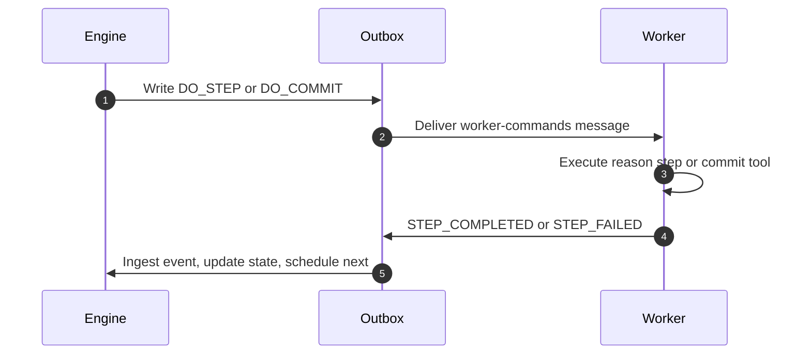
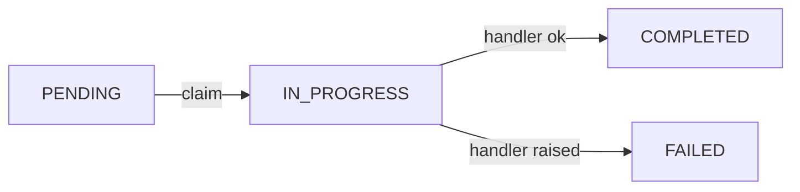

# Architecture

Warden at runtime is simpler than the manifest surface suggests. At its core, a deployment relies on a lightweight three-part topology — **engine**, **worker**, and **Postgres** — where state management and task execution stay strictly decoupled. You can customize or extend the system at startup (extra HTTP routes, CLI commands, lifecycle observers), but this execution loop stays intact. The sections below map that topology, how work moves through the transactional outbox, and how extensions attach when you need them.

:::note[Reference page]
This is a system map, not a local dev guide. For Compose and Makefile workflows see [Installation](../getting-started/installation.md). For saga status transitions and the per-step execution sequence see [Lifecycle](../concepts/lifecycle.md).
:::

## Runtime topology

Engine, worker, and Postgres share one coordination model: **Postgres is the message bus**. The engine and worker are shared-nothing peers—they never call each other to run steps. Both read and write rows in `outbox_events` (and domain tables) inside the same database. No RabbitMQ, Kafka, or engine→worker RPC mesh sits in the middle.

The execution loop flows in a continuous, database-backed cycle:

1. **Control** — The CLI drives and monitors the workflow lifecycle over HTTP to the engine.
2. **Stage** — The engine advances the saga FSM and commits both the new state and a `worker-commands` outbox row in the *same atomic transaction*.
3. **Execute** — Workers poll the outbox, claim `worker-commands` rows, and run LLM or MCP reasoning loops.
4. **Advance** — The worker writes an `engine-events` row (e.g. `STEP_COMPLETED`). The engine consumer ingests it and loops back to step 2 to schedule the next phase.

```text
  [ warden CLI ]
        │
      HTTP
        ▼
   [ Engine ] ◄─────── polls: engine-events ───────┐
        │                                          │
 writes: worker-commands                           ▼
        │                                     [ Postgres ]
        ▼                                   (outbox_events)
   [ Worker ] ◄──── polls: worker-commands ────────│
        │                                          │
        └─────────── writes: engine-events ────────┘
```

Here is how responsibilities split across your infrastructure:

- **Engine** — The brain. Manages the saga FSM, exposes the public HTTP API (start saga, human-in-the-loop review, operator recovery), evaluates CEL policy gates, and commits worker commands to the outbox in the same transaction as saga state updates.
- **Worker** — The muscle. Polls for commands, runs reason and commit steps (LLM agent loops and MCP tool calls), and reports results back through the outbox — never by writing directly into engine-owned saga rows.
- **Postgres** — The single source of truth. Stores manifest definitions, saga and step state, `outbox_events`, and idempotency guards (`processed_commands`, `processed_ingest_events`).

| Process | Role | Outbox topic consumed |
|---------|------|------------------------|
| **Engine** | Saga FSM, HTTP API, human-in-the-loop gate, outbox producer for worker commands | `engine-events` (worker → engine results) |
| **Worker** | Reason and commit execution, MCP tool governance, in-process claim reap | `worker-commands` (engine → worker dispatch) |
| **Postgres** | Domain tables, outbox streams, manifest definitions | — |

The engine and worker do not depend on extension packages at import time. Optional plugins register against a central registry at startup — they add observers, routes, or CLI groups; they do not replace the engine/worker command loop.

:::info[Deployment network topology]
Both the engine and worker are **outbound clients to Postgres**. The engine exposes HTTP for operators and integrators (`POST /v1/sagas/start`, human-in-the-loop review, recovery, deploy). Workers **do not** receive push commands from the engine over HTTP — they poll `outbox_events` for `worker-commands` rows. Step results flow the same way in reverse: the worker writes `STEP_COMPLETED` / `STEP_FAILED` rows to the `engine-events` topic, and the engine's outbox consumer ingests them.

For firewall planning: allow engine → Postgres, worker → Postgres, and clients → engine HTTP. You do **not** need a network path between the engine and worker zones—they only meet in Postgres.
:::

### Namespaces and tenancy

Warden isolates customer or environment data with a logical **`namespace`** column on saga, step, and manifest rows — not separate physical database schemas. Engine and worker processes connect to the same Postgres database; scaling out means running more worker replicas that all poll the shared outbox (coordinated by row locking). See [Terminology → Component identity](../concepts/terminology.md#component-identity) for how namespace fits manifest identity.

### Kernel packages

| Package | Role |
|---------|------|
| `common/` | Models, contracts, transactional outbox, CEL policy gate, plugin registry |
| `engine/` | Saga FSM, API routes, human-in-the-loop gate |
| `workers/` | Command handling, LLM/MCP adapters, tool governance, in-process claim reap |

Kernel code (`common/`, `engine/`, `workers/`, `cli.py`) runs its own logic first, then calls registry hooks for optional side effects. How to implement those hooks: [Extending Warden](extending-warden.md).

## Plugin architecture

Extensions follow **dependency inversion**: the kernel defines hook protocols and NoOp defaults; optional packages register real implementations when the process starts. CEL policy **evaluation** stays in the kernel — the `policy` slot observes outcomes; it does not replace the gate.

### Registry slots

| Slot | Purpose |
|------|---------|
| `engine` | Lifecycle hooks around saga FSM transitions |
| `policy` | Policy gate lifecycle (evaluated, denied, errored) |
| `worker` | Hooks into the worker command loop |
| `tools` | Custom tool sources or tool governance extensions |
| `adapter` | Hooks after reason steps — not LLM provider wiring |
| `http` | Additional FastAPI routes |
| `cli` | Additional CLI command groups |
| `messaging` | Outbox producer and consumer overrides |

Plugins may also register Tortoise model modules for extra tables; those join the same schema the engine and worker verify at startup.

### Boot sequence

Startup always follows the same order — plugins first, then messaging, then consumers:

1. **`load_plugins_from_env()`** — When `WARDEN_PLUGINS` is set (`module.path:callable`), imports the module and runs its install function. When unset, the registry keeps NoOp defaults.
2. **`wire_messaging_from_registry()`** — Binds messaging to the registry (default: Postgres outbox).
3. **Engine and worker entrypoints** — Each process creates its outbox consumer from the registry.
4. **API lifespan** — `get_registry().http.mount(app)` adds routes registered on the `http` slot.
5. **CLI `main()`** — `get_registry().cli.register(app)` adds command groups on the `cli` slot.

Kernel call sites follow one pattern — core logic, then an optional hook:

```python
await get_registry().engine.on_saga_transition(
    saga=saga,
    from_status=old,
    to_status=new,
    conn=conn,
    trace_context=trace_context,
)
```

Worker ports, hook protocols, and custom messaging: [Extending Warden](extending-warden.md).

## Transactional outbox

To prevent race conditions, orphan tasks, or missed state updates, Warden does not use direct synchronous RPC to trigger agent actions. Domain changes and outbox rows commit in the **same Postgres transaction**, then background consumers poll, claim, and process rows. That pattern gives **at-least-once delivery** — if a worker crashes mid-step, claim and outbox reap eventually make the command redeliverable.



For human-in-the-loop review, policy gates, and compensation dispatch in this flow, see [Lifecycle → The execution sequence](../concepts/lifecycle.md#the-execution-sequence).

Each outbox row moves through a simple status lifecycle:



Default topics: `engine-events` (worker → engine) and `worker-commands` (engine → worker).

The consumer processes **`PENDING` rows only**. A handler exception marks the row `FAILED` in one pass — there is no infinite retry on a single row. If a process crashes after claiming a row but before finishing, the row stays **`IN_PROGRESS`** until background outbox reap resets it ([Configuration — recovery timeouts](../getting-started/configuration.md#recovery-timeouts)) or an operator runs recovery commands. Full ladder: [Saga recovery](../guides/cli/saga-recovery.md).

Schema is **migration-only** — services do not auto-generate tables at runtime. The engine and worker verify required tables at startup and fail fast if migrations are missing. Apply order and backfill notes: [Migrations and schema](migrations-and-schema.md).

### Outbox on Postgres

Warden uses the **transactional outbox** pattern: when the engine advances saga or step state, it writes the corresponding outbox row in the **same database transaction**. There is no required external message broker in open core — **Postgres carries the work queue**. The engine and worker are decoupled peers: they coordinate through `outbox_events` on two logical topics (`worker-commands` for dispatch, `engine-events` for results). Teams that need a dedicated message bus or fleet-scale relay should read [Open Core vs Enterprise → Fleet scale and alternate messaging](../getting-started/open-core-vs-enterprise.md#fleet-scale-and-alternate-messaging).

### Scaling and operational limits

Warden is built for **agent workflows** — steps that often take seconds or minutes, not sub-millisecond micro-tasks.

1. **Agent steps are slow.** A single reason or tool step often takes seconds (sometimes minutes). Plan for that shape of work, not millions of tiny jobs per second.
2. **Scale by adding workers—or raising per-process concurrency.** Each worker process runs a limited number of steps at once (default: one, via `WORKER_MAX_IN_FLIGHT` in `.env`). To handle more concurrent step execution across your fleet, run more worker replicas, or raise `WORKER_MAX_IN_FLIGHT` so one process handles multiple step commands at once (typically across different saga instances—the engine still advances one forward step at a time per saga). Either way, budget more database connections. See [Configuration → Worker tuning](../getting-started/configuration.md#worker-tuning).
3. **The database is the coordination layer.** Engine and workers read and write the same Postgres instance. Workers claim only pending work—a step that runs for minutes does not block other queued commands from starting. A busy deployment still means more rows in `outbox_events` and more open connections; plan capacity accordingly.
4. **Rough expectation (scaled deployments):** on a single Postgres primary, think in terms of **low hundreds of concurrently active steps** as an order-of-magnitude planning figure — **after** you scale workers (many replicas and/or `WORKER_MAX_IN_FLIGHT` > 1). That is fleet-wide concurrency across many saga instances, not what the default dev stack gives you (`make up` runs one worker at `WORKER_MAX_IN_FLIGHT=1`, so one active step at a time). We have not published load benchmarks; treat this as capacity planning guidance, not a guarantee.
5. **Completed outbox rows stick around** unless you archive or prune them; monitor table growth over time.
6. **Recovery:** stale claims and stuck outbox rows are reset by background reap loops and operator commands — see [Configuration → Recovery timeouts](../getting-started/configuration.md#recovery-timeouts) and [Saga recovery](../guides/cli/saga-recovery.md). For how rows move through `PENDING` → `IN_PROGRESS` → `COMPLETED`, see [Transactional outbox](#transactional-outbox) above.

## Idempotency

Delivery is **at-least-once**. The same command may arrive more than once; three layers bound duplicate work:

| Layer | Mechanism | Effect |
|-------|-----------|--------|
| **Worker command claim** | `processed_commands.idempotency_key` | A duplicate delivery is skipped once the first run sets `result_emitted=true`. |
| **Stale crash recovery** | Claim reap and outbox reap (`WORKER_STALE_CLAIM_SECONDS`, `OUTBOX_STALE_IN_PROGRESS_SECONDS`; default 1800s) | Stale claims are deleted and stale `IN_PROGRESS` outbox rows reset for redelivery. |
| **Engine event ingestion** | `processed_ingest_events` dedup log | If a network retry delivers a duplicate `STEP_COMPLETED` or `STEP_FAILED` after the step already finalized, the engine safely drops it. |

If a worker drops offline mid-step, claim reap may redeliver. Commit steps and MCP tools should tolerate retry at the application boundary — see [MCP and tools → Designing for at-least-once delivery](../guides/manifests/mcp-and-tools.md#designing-for-at-least-once-delivery).

## What's next

You now have the runtime map: engine, worker, Postgres, outbox, registry. When you extend Warden — a new LLM provider, agent adapter, or lifecycle hook — you plug into the slots above without changing the FSM core. [Extending Warden](extending-warden.md) is the hands-on guide; [Testing](testing.md) shows where to add coverage for kernel changes.

## Related

- [Lifecycle](../concepts/lifecycle.md) — master saga FSM and execution sequence
- [Extending Warden](extending-warden.md) — LLM providers, agent adapters, registry hooks
- [Migrations and schema](migrations-and-schema.md) — SQL apply order
- [Saga recovery](../guides/cli/saga-recovery.md) — stuck outbox rows and operator recovery
- [Compensation](../guides/manifests/compensation.md) — rollback definitions and unwind
