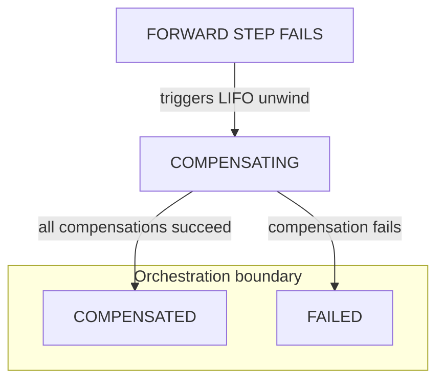

# Durable Execution Boundaries

Warden's core design principle is strict isolation: non-deterministic agent reasoning and database orchestration state advance together, or execution failures are transactionally captured for ordered recovery.

AI agents fail in ways ordinary retry loops cannot handle. An ephemeral worker might complete an LLM reasoning cycle, call a third-party tool that modifies an external system, and then crash or time out before the workflow engine records what occurred. The real-world side effect went through, but the orchestration state is lost. This mismatch leads to silent state drift, duplicate execution, and unrecoverable workflows.

Warden eliminates this class of failure by drawing a strict execution boundary between your volatile AI worker processes and your relational database state in Postgres.

## Volatile execution vs. durable state

Most workflow layers track agent state in volatile process memory or loose task queues. This approach breaks down when steps involve non-deterministic LLM loops, changing context, and compounding external tool dependencies.

When a worker process crashes mid-step in an in-memory workflow, you are left with partial, invisible state. You do not know if an external tool call executed, what arguments the LLM generated, or where it is safe to resume.

Warden shifts the source of truth entirely into the persistence layer:

1. **Pre-registered intent:** Every meaningful action a worker can take is written to Postgres as a structured row *before* execution begins.
2. **Transactional outbox bounds:** The orchestration engine cannot dispatch a command to a worker without atomically advancing the saga's internal state machine inside the same database transaction.
3. **Decoupled workspaces:** If a worker process exits abruptly or loses network access to its LLM endpoint, the engine does not stall or lose context. The state remains frozen and inspectable in Postgres, ready for an operator claim, a timed-out reaping cycle, or automated recovery.

When a step finishes, the worker reports `STEP_COMPLETED` or `STEP_FAILED` back via the outbox. The engine updates state transactionally — there is no window where a step is done in the worker but unknown to the database.

## Step roles

Warden splits its workflows into two step types so you can separate open-ended reasoning from single, inspectable side effects.

**Reason steps** (`kind: reason`) handle thinking and decision-making using an LLM.

- Use the **`react`** adapter if you want the agent to think, run a multi-turn loop, and interact with tools to gather context before returning an answer.
- Use the **`simple`** adapter if you just want a quick, single-turn translation or data transformation with no tool interactions.

*Typical pattern: reason steps explore and decide; commit steps isolate one explicit side effect. Mutating MCP tools on reason steps are allowed — nothing in the engine blocks writes on the allowlist.*

**Commit steps** (`kind: commit`) execute exactly one explicit action—like writing a database row, sending a Slack message, or posting a GitHub comment. Commit steps have no LLM, no autonomous loop, and exactly one tool in their allowlist.

*Use commit when you want a single side effect to stand alone: one tool call, `before_commit` policy, and optional human-in-the-loop review before anything leaves the engine.*

:::warning[Side effects on reason steps]
Mutating tools on reason steps are your choice — Warden does not block them. The reason/commit split is a **design convention**, not a hard sandbox.

If a reason step touches external state, plan for failure like any forward step: define [compensation](../guides/manifests/compensation.md), keep `tools.allow` tight, and remember that `after_reason` policy runs after the ReAct loop — tools may already have run. Prefer commit steps when one side effect should stand alone under `before_commit` and human-in-the-loop review.
:::

## Governed execution

Because Warden separates these step roles, the engine can insert deterministic guardrails at transaction boundaries. Instead of letting an agent run wild, Warden evaluates your CEL policies at two precise interception points:

1. **`after_reason` (on reason steps):** Checks the structured JSON output from the LLM before Warden writes it to saga context or passes it downstream.
2. **`before_commit` (on commit steps):** Checks the explicit tool arguments before Warden dispatches the MCP call to an external system.

If a policy evaluates to `false` or hits a validation failure, the engine fails the step cleanly and stops the saga from advancing. On commit steps, a violation blocks the external call before it runs; on reason steps, it prevents bad output from propagating (though tools may already have run during a ReAct loop — see the warning above).

## Failure and LIFO compensation

When a saga fails, you need to undo what already ran—in the right order. Warden tracks completed forward steps and reverses them last-in-first-out. The engine dispatches `EXECUTE_COMPENSATION` for each step that needs unwinding.

This is compensation, not a database rollback. Compensation is explicit logic you define for steps that touched external systems. Warden runs that logic reliably and in order.

When unwind finishes, the saga reaches a known terminal status in Postgres—`COMPENSATED` or `FAILED`—not an open-ended guess.

The diagram below shows the **orchestration boundary**—what happens after a forward step fails and LIFO unwind begins. The full saga map (`PENDING` through `COMPLETED`) is on [Lifecycle](lifecycle.md).

On forward failure, Warden enters `COMPENSATING` and unwinds completed steps in LIFO order using their defined `compensation:` blocks. If a step times out or a worker crashes mid-execution, Warden treats that active step's output as uncertain and includes it in the undo window to clear any partial side effects. If no steps are in scope to unwind, the saga transitions directly to `FAILED`.

Because Warden guarantees the execution of the compensation command—not the state of the external API—you should author idempotent undo tools and apply `compensation:` blocks to any step that mutates an outside system. See [Compensation](../guides/manifests/compensation.md).

## What you can build

You can build multi-step agent workflows for production—versioned YAML sagas where every reasoning loop, tool interaction, and state change is tracked as a durable row in Postgres.

Bring whichever LLMs and MCP servers fit your stack. Warden acts as the transactional ledger in your database, recording each step before a worker ever executes it. Bind agent behavior with tool allowlists, evaluate CEL policies at runtime, and add human-in-the-loop review gates when you need them.

Because workflow state lives in your database rather than process memory, you can inspect live progress mid-run, pause for approval, retry stuck steps, and run ordered LIFO rollbacks to unwind completed side effects when a downstream step fails. Execution state stays in Postgres—visible after a worker crash, not lost in memory.

## What this means in practice

Warden's core guarantee is durable, deterministic workflow state. Because the engine and workers coordinate through a transactional outbox, no worker can commit an action without an immediate, matching state transition in Postgres.

However, local durability is not a magic wand for external APIs. If a remote system times out or a worker crashes mid-network call, the outside world can drift ahead of what your database has recorded. Warden does not abstract this reality away; instead, it forces you to model it explicitly. Compensation is the deliberate undo path you author—and if that undo logic fails, Warden ensures the saga hits a hard terminal `FAILED` state with a traceable error rather than drifting silently.

Whether a step is executed, `SKIPPED` via a CEL condition, or paused at a human review gate, Warden's entire orchestration layer—the outbox, the policy engine, and the database boundaries—exists to keep your internal state coherent. It ensures that no matter how chaotic your external dependencies or LLM reasoning loops become, your database remains the source of truth.

## What's next

[Lifecycle](lifecycle.md) walks the full state machine—from start request through HITL pauses to terminal outcomes—and shows how engine and worker exchange commands through the outbox.

## Related

- [Lifecycle](lifecycle.md)
- [Compensation](../guides/manifests/compensation.md)
