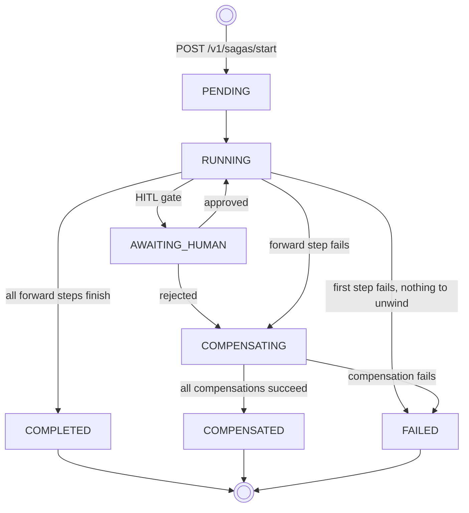
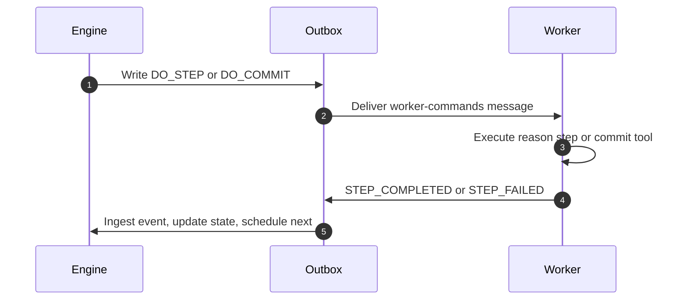

# Lifecycle

When you start a saga, the engine walks it through a fixed state machine—scheduling steps, pausing for human review, and unwinding completed work on failure. This page maps that path from deployed definition to a terminal outcome (`COMPLETED`, `FAILED`, or `COMPENSATED`). Read [Terminology](terminology.md) and [Durable execution boundaries](durable-execution.md) first if those concepts are new.

## From definition to instance

Deploying a saga manifest registers the workflow definition—nothing runs yet. When you call `warden start saga` (or `POST /v1/sagas/start`), the engine materializes an isolated execution instance from that blueprint: one saga run with a durable step row for every step in the manifest. The instance enters `PENDING`, then `RUNNING` as the engine begins scheduling.

Every state transition is driven by outbox events—the engine processes worker results and advances the FSM in one place.

## Saga state map

The diagram below traces a saga instance from start request through HITL pauses to terminal outcomes. For undo-window behavior at the compensation branch, see [Durable execution boundaries → Failure and LIFO compensation](durable-execution.md#failure-and-lifo-compensation).

## The execution sequence

For each step, the engine and worker exchange commands through the outbox:

1. Engine writes a `DO_STEP` or `DO_COMMIT` command to `worker-commands`.
2. Worker picks it up, runs the reason step (`react` or `simple`) or executes the tool call (commit).
3. Worker reports `STEP_COMPLETED` or `STEP_FAILED` via `engine-events`.
4. Engine updates step and saga state, then schedules the next step.

## Policy gates

After a reason step, the engine evaluates `after_reason` policies against the worker's structured output. A violation fails the step before any commit step runs.

Before a commit step executes its tool call, the engine evaluates `before_commit` policies. A violation fails the step cleanly and can trigger compensation for anything already completed.

## HITL pauses

Steps with a human-in-the-loop gate pause the saga at `AWAITING_HUMAN` before proceeding. The engine will not schedule the next step until a reviewer approves or rejects. On rejection, the saga transitions to compensation.

`AWAITING_HUMAN` is one of four in-flight saga states you will see with `warden list sagas --in-flight`, alongside `PENDING`, `RUNNING`, and `COMPENSATING`.

## Compensation

When a forward step fails and prior work may need undoing, the engine transitions the saga to `COMPENSATING` and dispatches `EXECUTE_COMPENSATION` commands in LIFO order for each step in the undo window. The saga settles at `COMPENSATED` when every scheduled undo succeeds, or `FAILED` when any undo fails. If nothing is in scope to unwind—for example, the first step fails with no completed work behind it—the saga goes straight to `FAILED` without entering `COMPENSATING`.

For undo-window rules, uncertain output on timeout or worker crash, and authoring `compensation:` blocks, see [Durable execution boundaries → Failure and LIFO compensation](durable-execution.md#failure-and-lifo-compensation) and [Compensation](../guides/manifests/compensation.md).

## Saga terminal states

| Status | Meaning |
|--------|---------|
| `COMPLETED` | All forward steps finished successfully. |
| `FAILED` | Forward path halted and unwind could not complete cleanly. |
| `COMPENSATED` | Forward path halted, unwind ran, and every scheduled compensation succeeded. |

## Step `SKIPPED`

A step shows `SKIPPED` when it never ran. That happens in two cases:

1. **Conditional bypass:** A forward step's `when.cel` evaluates to `false` before scheduling—the engine skips it and continues to the next blueprint step, or completes the saga if none remain.
2. **Path never reached:** The saga reaches a terminal state before execution would have scheduled that step.

If a `when.cel` condition errors at runtime — usually a typo or a missing context variable — the engine won't skip the step. It flags the step as `FAILED` and records `WHEN_EVALUATION_FAILED` in status tracking. Invalid `when.cel` syntax is caught when you deploy the saga. See [Conditional branching (`when.cel`)](../guides/manifests/when-cel.md).

:::tip[Defensive `when.cel`]
Use `has()` before reading optional paths—especially `steps.<id>.facts.<into>` when the tool may not have run. That turns a missing bucket into `false` (skip) instead of an evaluation error (fail).
:::

## What's next

You have the mental model—definitions, instances, states, and outbox handoffs. Continue to [Prerequisites](../getting-started/prerequisites.md) to map the local stack, or jump to [Installation](../getting-started/installation.md) if you are ready to run Warden.

## Related

- [Terminology](terminology.md)
- [Durable execution boundaries](durable-execution.md)
- [Compensation](../guides/manifests/compensation.md)
- [Architecture](../advanced/architecture.md)
