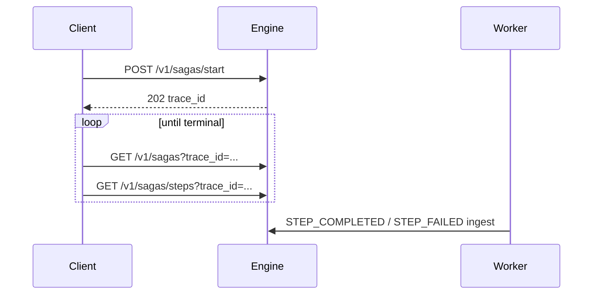

# Start and monitor

Starting a saga returns a `trace_id` immediately; workers execute steps asynchronously via the outbox. Integrators **poll** collection endpoints by `trace_id` until the saga reaches a terminal status or pauses at `AWAITING_HUMAN`.

After start, **`trace_id`** is your handle for everything — a 32-character hex token, not the manifest name or version. Copy it from the start response and use it for poll, HITL, and recovery calls.

## Routing reference

| Operation | Method | Literal path | `trace_id` |
|-----------|--------|--------------|------------|
| Start | `POST` | `/v1/sagas/start` | Response body |
| Poll saga | `GET` | `/v1/sagas` | Query: `?trace_id=<hex>` |
| Poll steps | `GET` | `/v1/sagas/steps` | Query: `?trace_id=<hex>` (required) |

`trace_id` must match `^[a-f0-9]{32}$` (32-character lowercase hex); invalid values → **422**.

There is **no** path-parameter GET for a saga instance (no `/v1/sagas/{trace_id}`). Poll the saga with `GET /v1/sagas?trace_id=…` instead. Once you have a `step_span_id` from the step list, you **can** fetch one step directly — see [Step detail](#step-detail) below.

## Start a saga

```bash
curl -sS -X POST "$ENGINE_URL/v1/sagas/start" \
  -H "Content-Type: application/json" \
  -d '{
    "namespace": "default",
    "name": "minimal-saga",
    "version": "0.0.1",
    "input": {}
  }'
```

Response (**202 Accepted**):

```json
{ "trace_id": "7f3a9c2e1b4d8f0a6e5c3b2a1d9f8e7c" }
```

### Request body

Definition lookup uses composite key `(namespace, name, version)`. Omitted `namespace` resolves to `"default"`.

| Field | Required | Description |
|-------|----------|-------------|
| `name` | yes | Saga definition name |
| `version` | yes | Saga definition version |
| `namespace` | yes (defaults to `"default"` if omitted) | Definition namespace |
| `input` | no (default `{}`) | Initial saga context object |
| `idempotency_key` | no | Duplicate starts with the same `(namespace, idempotency_key)` pair return the existing `trace_id` |

When you start a saga, Warden stores your payload under the **`input`** key in saga context — not at the context root. Manifest bindings use JSONPath like `$.input.repo`; `when.cel` and policy CEL expose the same shape as top-level `input` (for example `input.owner`). See [Saga manifests → Bindings](../manifests/saga-manifests.md#bindings-with).

:::tip[Namespace-scoped idempotency]
Start idempotency keys are **not global**. The same `idempotency_key` string in two different `namespace` values starts two independent saga instances — there is no cross-namespace collision.
:::

CLI equivalent: `warden start saga -n minimal-saga -v 0.0.1 --namespace default`.

## Poll saga status

```bash
ENGINE_URL=http://127.0.0.1:8000
TRACE_ID=<from start response>

curl -sS "$ENGINE_URL/v1/sagas?trace_id=$TRACE_ID"
```

Optional query parameters:

| Parameter | Description |
|-----------|-------------|
| `trace_id` | Single saga instance (32-char hex) |
| `in_flight` | `true` — non-terminal sagas (`PENDING`, `RUNNING`, `AWAITING_HUMAN`, `COMPENSATING`); do not combine with `status` filters |
| `failed` | `true` — only `FAILED` sagas |
| `status` | Filter by saga status (repeatable) |
| `namespace` | Filter by namespace |

Read `items[0].status` when the filter matches (normally exactly one row). An empty `items` array right after **202** is unusual — double-check `trace_id` and any `namespace` filter before assuming the start failed.

CLI equivalent: `warden list sagas --trace-id $TRACE_ID`.

## Poll step rows

```bash
curl -sS "$ENGINE_URL/v1/sagas/steps?trace_id=$TRACE_ID"
```

Optional query filters: `namespace=default` (must match instance row if set), repeatable `status=IN_PROGRESS` (etc.). Returns **404** if no saga row exists for that `trace_id`.

Each item includes `step_span_id`, `step_id`, `status`, `order_index`, `step_kind`, `worker`, `compensates_span_id` (set on undo rows), timestamps, and `error_details` (nullable — present when the step failed).

CLI equivalent: `warden list steps --trace-id $TRACE_ID --json` — use it to inspect `error_details` on failed steps.

## Step detail

When you need resolved inputs, outputs, or prompt refs for one step (not just list metadata), call the single-step route — this is separate from saga-level polling above:

```http
GET /v1/sagas/{trace_id}/steps/{step_span_id}?namespace=default
```

Returns one step row with `resolved_arguments`, `output_payload`, and `prompt_ref` in addition to the list fields (`status`, `timing`, `error_details`, etc.).

CLI equivalent: `warden show step <trace_id> <step_span_id>` or `warden show step <trace_id> --step-id <step_id>`.

## Poll loop example

Poll saga and step collection endpoints until `items[0].status` on the saga response is terminal (`COMPLETED`, `FAILED`, or `COMPENSATED`). Parse JSON with your HTTP client or language library — do not rely on shell `grep` against raw JSON.

```bash
ENGINE_URL=http://127.0.0.1:8000
TRACE_ID=<your trace_id>

# Example: poll every 2s (stop when saga status is terminal)
while true; do
  curl -sS "$ENGINE_URL/v1/sagas?trace_id=$TRACE_ID"
  curl -sS "$ENGINE_URL/v1/sagas/steps?trace_id=$TRACE_ID"
  sleep 2
done
```

For interactive polling from the terminal, prefer `warden list sagas --trace-id $TRACE_ID --watch` and `warden list steps --trace-id $TRACE_ID --watch` — see [Start and monitor (CLI)](../cli/start-and-monitor.md).



## Saga and step statuses

| Saga status | Meaning |
|-------------|---------|
| `PENDING` | Instance created; scheduling in progress |
| `RUNNING` | Actively executing steps |
| `AWAITING_HUMAN` | HITL hold — [HITL](hitl.md) |
| `COMPENSATING` | Rolling back completed steps |
| `COMPLETED` | Terminal success |
| `FAILED` | Terminal failure |
| `COMPENSATED` | Terminal after successful undo |

For compensation behavior on `FAILED` / `COMPENSATING`, see the [Compensation guide](../manifests/compensation.md).

Filter in-flight sagas: `GET /v1/sagas?trace_id=$TRACE_ID&in_flight=true` (do not combine with `status` filters).

## Stuck steps

If a step stays `IN_PROGRESS` while the worker is healthy, wait for [recovery timeouts](../../getting-started/configuration.md#recovery-timeouts) first, then call operator recovery:

```bash
curl -sS -X POST "$ENGINE_URL/v1/sagas/$TRACE_ID/steps/$STEP_SPAN_ID/retry-step?namespace=default" \
  -H "Content-Type: application/json" \
  -d '{}'
```

If the response is **202** with `"status": "claim_active"`, a worker still holds a non-stale claim — wait for automatic reap or resend with `"force": true` (commit steps also need `"allow_destructive": true`). Full ladder: [Recovery](recovery.md).

## What's next

If the saga pauses at `AWAITING_HUMAN`, submit a decision via [HITL](hitl.md). If a step is stuck in `IN_PROGRESS`, see [Recovery](recovery.md). CLI equivalent: [Start and monitor](../cli/start-and-monitor.md). Schema details: [API Reference](/docs/api/api-reference) — [Post Sagas Start](/docs/api/post-sagas-start-v-1-sagas-start-post), [Get Sagas](/docs/api/get-sagas-v-1-sagas-get), [Get Saga Steps](/docs/api/get-saga-steps-v-1-sagas-steps-get).
